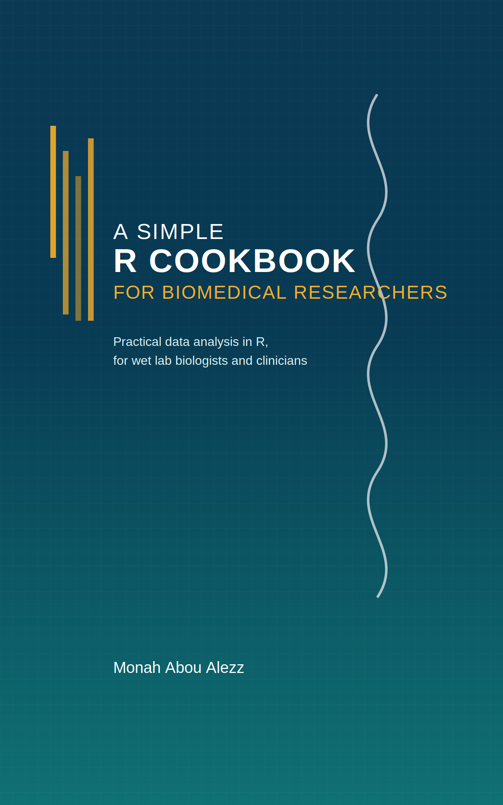

# Welcome! {-}

Welcome to **A Simple R Cookbook for Biomedical Researchers**.

This book is written for wet lab scientists, clinicians, and other biomedical
researchers who want to analyse their own data in R without becoming
full‑time programmers.

This website is and will always be free, licensed under the **CC BY-NC-ND 4.0 License**.
If you’d like a physical copy of the book, you can order it on Amazon.

{.book-cover}

